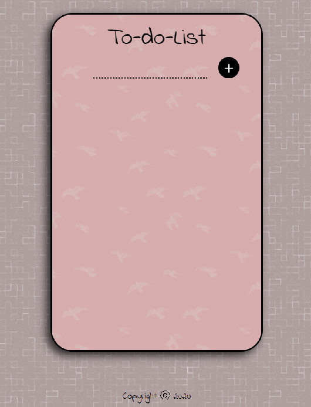

# To Do List

> This is a React.js application that will help you plan your day. Keep track of everything you have to get done and make sure you won't forget anything.

## Table of contents

- [Screenshots](#screenshots)
- [Technologies](#technologies)
- [Setup](#setup)
- [Features](#features)
- [Inspiration](#inspiration)

## Screenshots

## Technologies

- JavaScript ES6
- Bootstrap - version 4.0
- React JS - version 16.12.0

## Setup

To run this project install it locally using npm:

- cd.../To-Do-List
- npm install
- npm start

Link to application: https://drzasta.github.io/To-Do-List/

## Features

- Add new task using "+"
- Remove task by clicking on task
- Use it on your you computer or phone

## Inspiration

This app is inspired by Angela Yu (https://www.udemy.com/course/the-complete-web-development-bootcamp/)
